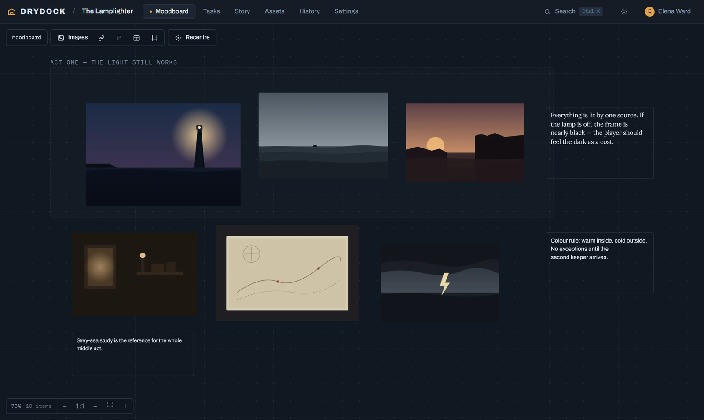
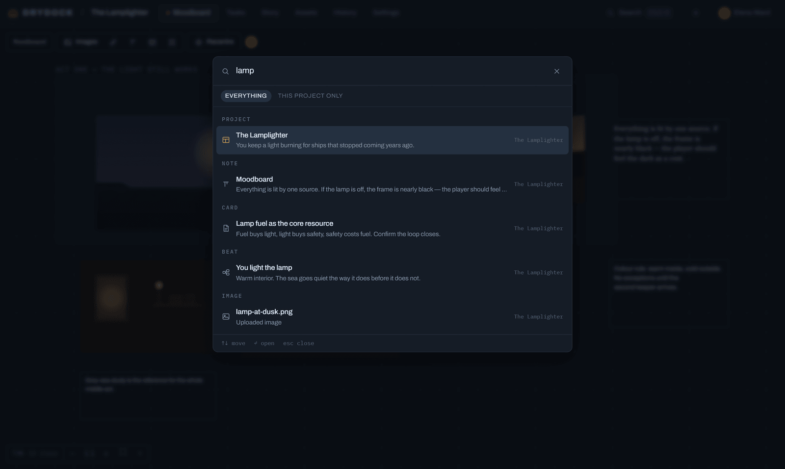
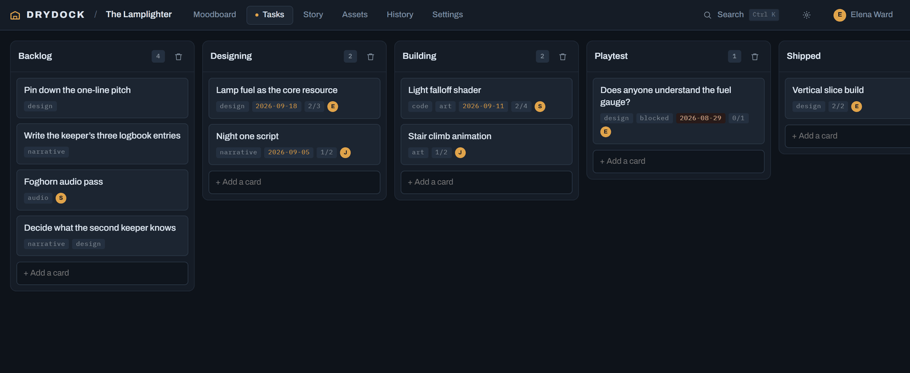
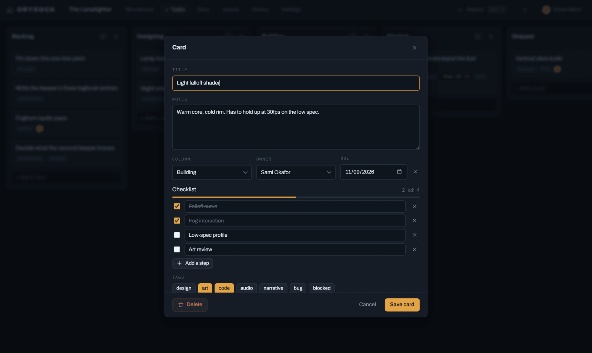
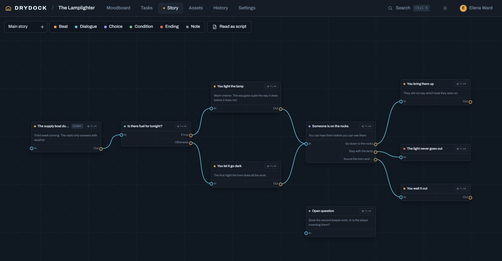
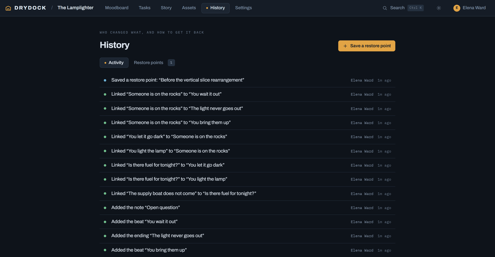
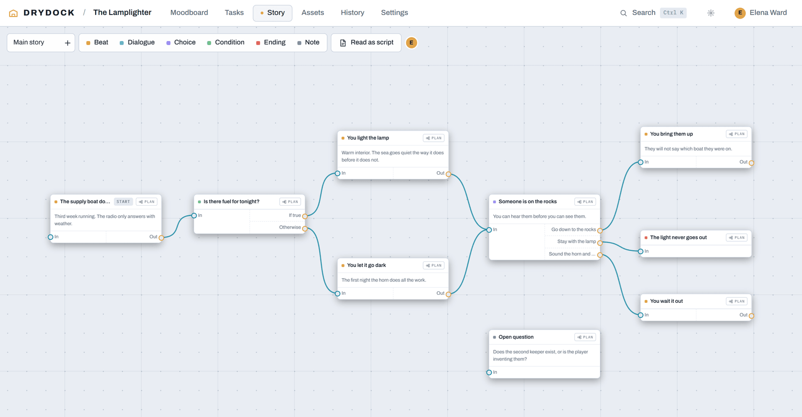

# Drydock

[](https://github.com/ThomasYates/drydock/actions/workflows/ci.yml)
[](LICENSE)
[](https://github.com/ThomasYates/drydock/pkgs/container/drydock)

A self-hosted workspace for planning games.

Designing a game generates three kinds of thinking at once. You collect
references and stare at them. You keep a list of what needs doing. You work out
what happens, and what happens instead if the player does the other thing.

Most people end up with those three in three different tools — a Pinterest
board, a Trello board, and a Twine file or a wall of sticky notes — none of
which know about each other. Six months later the reference that explains the
mood of a level is in one place, the task that says to build it is in another,
and the scene it belongs to is in a third. Nothing links up, and searching means
remembering which tool you were in at the time.

Drydock puts all three in one project, on one server you own:

- **Moodboard** — an infinite canvas for reference images, notes and grouping
  frames. Boards nest inside boards, as deep as you like.
- **Tasks** — a Trello-style board with checklists, owners and due dates.
- **Story** — a branching node graph. Every node carries as many named ways in
  and ways out as you want, and can be opened up onto a planner page of its own.
- **History** — every change, who made it, and full restore points you can roll
  back to.

One search box covers all of it. Everything is multiplayer: you see everyone
else's pointer in their own colour, watch them drag things around live, and
changes land on your screen as they make them.

There is no cloud service, no account to sign up for, and nothing phones home.
It is one container and one folder of data.



---

## Running it

Save this as `compose.yaml` and run `docker compose up -d`:

```yaml
services:
  drydock:
    image: ghcr.io/thomasyates/drydock:latest
    container_name: drydock
    restart: unless-stopped
    ports:
      - "8787:8787"
    environment:
      TZ: Europe/London
      # Serving over HTTPS, through a reverse proxy or a Cloudflare Tunnel?
      # Uncomment both, or the session cookie will not stick.
      # SECURE_COOKIE: "1"
      # TRUST_PROXY: "1"
    volumes:
      - drydock-data:/data

volumes:
  drydock-data:
```

Then open `http://<your-server>:8787`. The first person to open a fresh install
creates the admin account, and everyone else is added from the People page.

That is the whole installation. One container, one volume. The image is built
for `linux/amd64` and `linux/arm64`, so it runs on an x86 server and on an ARM
NAS or a Raspberry Pi alike.

### On a NAS

Dockge, Portainer and TrueNAS all take the file above as-is — paste it into a
new stack and deploy. Their **Update** button does the right thing, because the
image is pulled rather than built.

To keep the data somewhere you can see it, swap the volume for a bind mount:

```yaml
    volumes:
      - /mnt/tank/apps/drydock:/data
```

### Updating

Drydock tells you when there is a new version. It reads the public GitHub
releases list every six hours and, when a newer one exists, puts a notice across
the top of the web app and a line in Admin. Nothing is sent anywhere — it is one
read of a public URL — and `UPDATE_CHECK=0` switches it off completely.

Taking the update is two commands, in the folder holding your `compose.yaml`:

```bash
docker compose pull && docker compose up -d
```

The `/data` volume is untouched, so nothing is lost. Admins also get a **Check
for updates** button under People and settings, for when you would rather look
now than wait.

Drydock deliberately cannot update itself. Doing that would mean mounting the
Docker socket into the container, and any bug in a web app with the Docker
socket is root on the host. Two commands is the honest trade.

### Building from source instead

If you have changed the code, or would rather not pull a prebuilt image:

```bash
git clone https://github.com/ThomasYates/drydock.git
cd drydock
docker compose -f compose.build.yaml up -d --build
```

The first build takes a few minutes — it compiles the frontend and builds
`better-sqlite3` and `sharp` for your architecture.

---

## Settings

Every one of these is optional.

| Variable | Default | What it does |
| --- | --- | --- |
| `PORT` | `8787` | Port inside the container |
| `DATA_DIR` | `/data` | Database and uploads |
| `TRUST_PROXY` | `0` | Set to `1` behind a tunnel or reverse proxy |
| `SECURE_COOKIE` | `0` | Set to `1` when served over HTTPS |
| `SESSION_DAYS` | `30` | How long a sign-in lasts |
| `IMAGE_MAX_EDGE` | `2200` | Longest side kept, in pixels |
| `IMAGE_QUALITY` | `78` | WebP quality, 1-100 |
| `MAX_UPLOAD_MB` | `40` | Per-file upload ceiling |
| `MAX_IMPORT_MB` | `512` | Ceiling for an imported archive |
| `UPDATE_CHECK` | `1` | Set to `0` to never contact GitHub |
| `UPDATE_REPO` | `ThomasYates/drydock` | Which releases to watch |
| `UPDATE_CHECK_HOURS` | `6` | How often to look |

`TRUST_PROXY` and `SECURE_COOKIE` are separate on purpose. `TRUST_PROXY` says
"believe the `X-Forwarded-For` header"; `SECURE_COOKIE` says "there is TLS in
front of me". Behind a proxy that terminates TLS you want both. Behind one that
does not, setting `SECURE_COOKIE` would stop anyone signing in.

### Data

Everything lives in `/data`: `drydock.db` (SQLite, WAL mode), `uploads/` (WebP
images) and `snapshots/` (restore points). Backing up means copying that one
directory.

---

## Behind a reverse proxy

WebSockets have to be proxied properly or live sync silently falls back to
nothing. Set `TRUST_PROXY=1` and `SECURE_COOKIE=1` and redeploy.

For a Cloudflare Tunnel:

```yaml
ingress:
  - hostname: drydock.yourdomain.com
    service: http://drydock:8787
    originRequest:
      noTLSVerify: true
  - service: http_status:404
```

Use `http://drydock:8787` if `cloudflared` runs as its own container on the same
Docker network, or `http://localhost:8787` if it runs on the host. Leave
WebSockets enabled in the Cloudflare dashboard (Network → WebSockets); it is on
by default on every plan.

A Cloudflare Access policy in front of the hostname makes a good second lock.
Drydock's own login still applies underneath it.

---

## Using it

### Search

`Ctrl/Cmd + K` from anywhere. One query covers notes on a moodboard, cards,
story beats, board names, project names and uploaded filenames, across every
project — or narrowed to the one you are in. Picking a result does not just open
the right tab: it frames the thing you searched for on the canvas and selects
it.



### Moodboard

| Action | How |
| --- | --- |
| Pan | Middle-drag, right-drag, or hold Space and drag |
| Zoom | Mouse wheel (toggle wheel-to-pan in the bottom bar) |
| Select | Click, Shift-click to add, drag on empty space for a marquee |
| Edit a note | Double-click it, click it once when it is already selected, press Enter, or use the inspector button |
| Finish a note | Enter saves and closes it; Shift+Enter starts a new line |
| Add images | Toolbar, drag files onto the canvas, or paste from the clipboard |
| Add from the web | Paste a URL, or use the link button — the file is copied to your server |
| Nest a board | Board button in the toolbar, then double-click the tile to go in |
| Duplicate | `Ctrl/Cmd + D` |
| Layer order | `[` and `]` |
| Nudge | Arrow keys, `Shift` for bigger steps |
| Copy and paste | `Ctrl/Cmd + C`, then `Ctrl/Cmd + V` pastes under the pointer |
| Cut | `Ctrl/Cmd + X` |
| Add something at a spot | Right-click the canvas |
| Get un-lost | **Recentre** in the toolbar, or the `Home` key |
| Delete | `Delete` or `Backspace` |

**Right-click an item** for the quick things: download an image or open it full
size, copy a note's words, make a picture the project cover, copy, paste,
duplicate, change layer order, delete.

**Typefaces on notes.** Each note carries its own, chosen in the inspector.
These are independent of the interface typeface, so changing one never disturbs
the other.

**Image quality.** Uploads are re-encoded to WebP and stored with a small proxy
alongside. On the canvas each image can be set to Auto, Proxy or Full. Auto uses
the proxy while the image is small on screen and swaps to the full version as
you zoom in, which is what keeps a board with hundreds of references responsive.

### Tasks

Cards carry notes, tags, an owner, a due date and a checklist. The card face
shows what matters at a glance: the tags, the due date in amber (red once it has
passed), how far through the checklist you are, and who has it.



Opening a card gives you the rest of it. Ticking a step is one click, and
nothing needs saving separately from the card.



Drag cards between columns, or right-click one to move it. Right-click the board
to add or rename a column. Deleting a column holding five or more cards writes a
restore point first.

### Story



**Ports.** Every node has named ways in down its left rail and ways out down its
right. Add, rename and remove them in the inspector, or right-click a node.
Choice nodes start with one way out per option.

**Linking.** Drag from a dot onto another node — drop on a specific dot to pick
the exact port, or anywhere on the card to take its first one. Or click a dot
once and let go, then click the target; Escape drops it. Links work in either
direction.

**Sizing.** Select a node and drag the corner handle. Setting height back to 0
lets the card size itself to its content.

**Planner pages.** Any node can be opened up onto a page of its own. The page
starts with one marker per port on the node above: a node with 2 ways in and 3
ways out gives you two entry markers and three exit markers already on the
canvas, and you plan the route between them. Markers stay in step with the node
above — rename a port and the marker renames, remove a port and its marker goes.
Pages nest as deep as the story needs.

**Selecting and copying.** Drag a box across empty canvas to lasso a group, or
Shift-click. `Ctrl/Cmd + C` then `Ctrl/Cmd + V` pastes under the pointer,
keeping the layout and rebuilding any links that ran between the copied nodes.
The clipboard survives moving between pages. Select a node and press **Tab** to
spawn the next beat already connected.

**Read as script** flattens every route from every entry point into markdown,
and ends with a *Loose ends* list of every branch that does not go anywhere yet
— useful for catching the option you wrote and forgot to wire.

### History and restore points

Every meaningful change is logged with who did it. Repeated nudges of the same
kind fold into one row, so an afternoon of dragging references around does not
bury the fact that someone deleted a column.



A **restore point** is a complete copy of the project. Three ways they get
written:

- **By hand**, from the History tab.
- **Automatically before anything destructive**: deleting eight or more board
  items, deleting any nested board, deleting a column holding five or more
  cards, or deleting a story thread.
- **Once a day** while a project is being worked on, keeping the last 14.

Only an admin can restore. Restoring always writes a safety copy of how things
look right now *first*, so the restore itself can be undone — the History tab
puts an **Undo this restore** button directly on that entry.

Deleted images keep their files on disk while any restore point still refers to
them, so rolling back genuinely brings the pictures back rather than leaving
broken tiles.

### Moving a project somewhere else

A restore point covers "put this project back the way it was on Tuesday". It
does not cover "put this project on a different machine" — it lives inside the
database it belongs to.

**Export** does. A project's Settings tab gives you one zip holding everything:
boards, nested boards, cards, story threads and every picture. **Import** on the
Projects page takes that zip back, in this install or any other, and builds a
new project from it with fresh ids throughout. Importing the same file twice
gives you two projects rather than a half-overwritten one.

That makes it a backup, a way to move machines, and a way to hand a whole
project to someone else.

### Appearance

The palette button beside your name sets dark or light mode, the secondary
colour used for anything selected or active, and the interface typeface. Those
three are saved to your account, so they follow you between machines.



**Interface scale** (80% to 150%) is kept on the device instead, because the
right size on a big monitor is the wrong size on a laptop and the same login
gets used on both.

### Typing and saving

Nothing typed anywhere in Drydock needs a save button. Every text field saves
itself three ways: after a short pause in typing, when you leave the field, and
if the panel it lives in is closed out from under it. Enter commits and closes;
on multi-line fields Shift+Enter starts a new line and Ctrl+Enter commits.

### On a phone

Anyone opening Drydock on a phone gets a full-screen warning first: the canvases
are built around a mouse, and right-click menus and keyboard shortcuts have no
touch equivalent. There is a **Carry on anyway** button, and it only asks once
per device.

---

## Accounts

Accounts are admin-created. There is no public sign-up: the first person to open
a fresh install becomes the admin, and every other account is made from the
People page with a starting password that the new person is asked to replace on
first sign-in. Resetting someone's password signs them out everywhere.

### Changing someone's login name

Display names are editable by their owner under Account. The login name is not,
so it does not drift out of step with whatever anyone remembers. Change it from
the shell:

```bash
docker exec -it drydock node src/cli.js rename-user
```

Run it with no arguments and it lists the accounts and asks. The password,
everything the account owns and any open sessions all carry on unaffected.

### Deleting a project

You cannot, from the web app. A project is the one thing no restore point can
bring back, so it lives behind shell access:

```bash
docker exec -it drydock node src/cli.js delete-project
```

It lists what is there, shows you exactly what would be destroyed, and asks you
to type the project name out in full before it does anything.

---

## Security

Drydock is built to sit on a network you control, behind your own front door.
Within that, it does the obvious things properly:

- Passwords are bcrypt. Sessions are `HttpOnly` cookies, and repeated wrong
  guesses are throttled per account and address.
- Uploads are served only to signed-in accounts, never publicly.
- Every response carries a content security policy, and the API is rate limited.
- Adding an image by URL is the one outbound request Drydock makes on your
  behalf, so it is checked: the hostname is resolved, anything on a private or
  internal network is refused, and every redirect hop is checked the same way.
  That closes the server-side request forgery hole such a feature otherwise is.
- Imported archives cannot write outside the uploads folder, whatever the file
  names inside them claim.

If you find something, please report it privately through
[GitHub's security advisories](https://github.com/ThomasYates/drydock/security/advisories/new)
rather than opening an issue. See [SECURITY.md](SECURITY.md).

---

## Development

```bash
git clone https://github.com/ThomasYates/drydock.git
cd drydock
npm run install:all
```

Then, in two terminals:

```bash
npm run dev:server
```

```bash
npm run dev:web
```

The web dev server runs on port 5173 and proxies the API and WebSocket through
to the server on 8787. Data goes in `server/data/` unless you set `DATA_DIR`.

| Command | What it does |
| --- | --- |
| `npm run lint` | ESLint over both halves |
| `npm test` | The server suite |
| `npm run build` | Production frontend build |
| `npm run check` | Lint and test together, as CI runs them |

Tests use Node's own runner against a real server, a real SQLite file and real
HTTP — no mocks, because the things most likely to break here are the seams.
`npm test` from the root, or `npm --prefix server run test:watch` while working.

New behaviour wants a test with it. See [CONTRIBUTING.md](CONTRIBUTING.md).

### Layout

```
server/src/
  app.js          the Express app, built by a function so tests can mount it
  index.js        entry point: listen, background jobs, clean shutdown
  db.js           schema and SQLite bootstrap
  auth.js         sessions, hashing, login throttling
  security.js     rate limiting and response headers
  net.js          the outbound-request guard
  realtime.js     WebSocket rooms, presence, op broadcast
  history.js      activity log, snapshots, restore, image retention
  search.js       one query across every kind of thing
  transfer.js     project export and import
  updates.js      the GitHub release check
  semver.js       just enough version comparison to answer "is that newer?"
  routes/         auth · projects · boards · kanban · story · images ·
                  history · search · updates · transfer
web/src/
  lib/canvas.js   the shared pan/zoom engine
  lib/realtime.js WebSocket client with reconnect and resync
  lib/focus.js    landing on the thing a search result pointed at
  components/     Moodboard · Story · Kanban · Assets · History · Admin ·
                  Search · UpdateBanner
```

Both canvases run on the same viewport engine, so panning, zooming and
fit-to-content behave identically in each.

---

## Licence

MIT. See [LICENSE](LICENSE).
